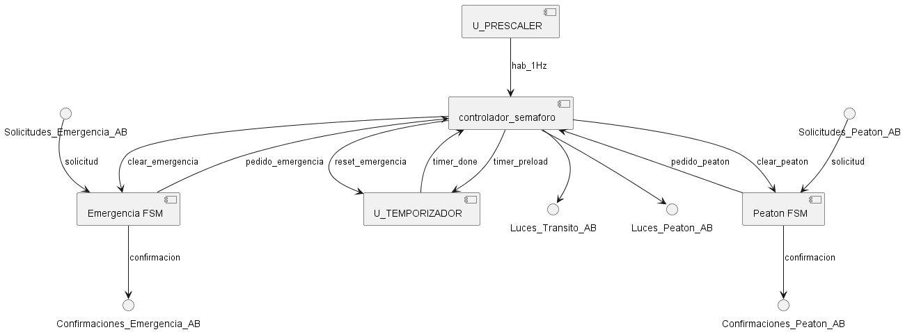
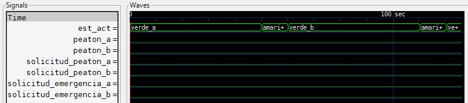
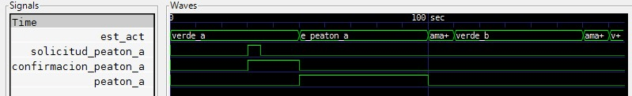
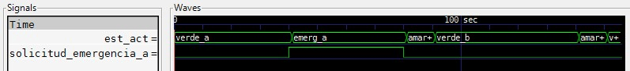
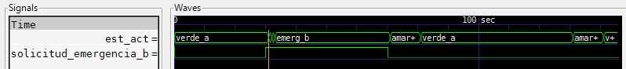

# ACTIVIDAD 6

## CONTROLADOR DE SEMAFORO

### SANTILLAN ATILIO EMANUEL

### INGENIERIA ELECTRONICA

### 2025

---

## Resumen

En el siguiente informe, se detallan los enfoques y metodos aplicados para la elaboracion de un controlador de semaforo, con pedido peatonal y solicitud de emergencia, aplicando los conceptos de maquina de estado finito factorizada.

---

## Introducción

Se desea controlar dos semaforos en una interseccion de calles, a una direccion la llamaremos A, y a la otra B. Ademas, el controlador deberá incorporar un sensor detector de servicios de emergencia y un pulsador de cruce peatonal.

### Secuencia normal (sin solicitudes)

- Rojo (60 seg)
- Verde (50 seg)
- Amarillo (10 seg)

### Servicio de emergencia detecado.

- Si una dirección está en rojo y se activa el detector de servicios de emergencia en dicha dirección, la otra dirección pasará de inmediato a amarillo, para luego dar paso a la dirección de emergencia.
- Si una dirección está en verde y se activa el detector de servicios de emergencia en dicha dirección, permanecerá en verde hasta que el detector se desactive.
- Si una dirección está en modo de emergencia, la otra no puede entrar a dicho modo hasta que se despeje la primera.

### Solicitud de cruce peatonal

- El modo de cruce peatonal extiende al doble el tiempo verde de la dirección correspondiente.
- Si la otra dirección entra en modo de emergencia durante el verde de cruce peatonal, esperará igualmente a que finalice normalmente el verde del cruce peatonal (no inicia el amarillo de inmediato).

## Materiales y Métodos

### Enfoque de Máquina de Estado Finito Única

En este enfoque, el comportamiento completo del sistema se modela como una única y monolítica máquina de estado finito (FSM). Todos los modos de operación, condiciones de entrada y secuencias de salida se encapsulan dentro de un solo conjunto de estados y una única función de transición y de salida. A medida que aumenta la complejidad del sistema (requiriendo la gestión de más entradas, salidas o modos de operación concurrentes), el número total de estados en esta FSM única puede crecer exponencialmente. La lógica de transición resultante se vuelve intrincada, evaluando múltiples condiciones simultáneamente para determinar el próximo estado. Si bien este método puede ser adecuado para sistemas simples, en diseños más complejos, la conceptualización, el diseño, la verificación y el mantenimiento de una FSM única y extensa se vuelven progresivamente más difíciles y propensos a errores.

### Enfoque de Máquina de Estado Finito Factorizada (Implementado)

Segun Wakerly, 2001:

> "Del mismo modo que los procedimientos o subrutinas largos en un lenguaje de programación, las máquinas de estado extensas son difíciles de conceptualizar, diseñar y depurar. Por tanto, cuando nos enfrentamos a un problema extenso de máquina de estado, los diseñadores digitales con frecuencia buscan oportunidades para resolverlo con una colección de máquinas de estado más pequeñas (...) Una **máquina principal** proporciona las entradas y salidas primarias, y ejecuta el algoritmo de control de nivel superior. Las **submáquinas** efectúan los pasos de nivel inferior bajo el control de la máquina principal, y pueden, de manera opcional, manejar algunas de las entradas y salidas primarias."

Para la realización de este proyecto, se optará por el enfoque de **maquina de estado factorizada**. Las _submaquinas_ a realizar serán las siguientes:

- **Prescaler:** Genera un pulso de habilitacion de 1Hz.
- **Temporizador:** Cuenta los segundos que le solicite la maquina principal.
- **Peaton_fms:** Maneja la solicitud y confirmación del peatón.
- **Emergencia_fms:** Maneja la solicitud y confirmación de emergencia.

---

## Resultados

En esta sección se presenta la estructura del diseño VHDL realizado para el controlador de semáforo, basado en el enfoque de máquina de estado finito (FSM) factorizada, y se resumen los resultados de su verificación mediante simulación.

---

### Descripción del Hardware (VHDL)

El sistema se implementó modularmente en VHDL (estándar 2008), separando la lógica en:

1.  **FSM Principal (`controlador_semaforo.vhd`):** Maneja la secuencia general del semáforo. Define los estados principales de tránsito (`VERDE_A`, `AMARILLO_A`, `VERDE_B`, `AMARILLO_B`), los estados extendidos para peatones (`E_PEATON_A`, `E_PEATON_B`), y los estados de prioridad y cancelación para emergencias (`EMERG_A`, `EMERG_B`, `CANCELA_A`, `CANCELA_B`). Su lógica de transición (`les`) prioriza las emergencias, luego los peatones (al finalizar un ciclo verde), y finalmente sigue el ciclo normal basándose en la señal `timer_done`. La lógica de salida (`ls`) asigna los estados de las luces (`transito_a/b`), controla la luz de cruce (`peaton_a/b`), genera las señales `clear_peaton_a/b` y `clear_emergencia_a/b` para resetear las submáquinas, y configura el `timer_preload` según el estado actual (tiempo normal, extendido o especial).

2.  **FSM Peatón (`peaton_fsm.vhd`):** Componente reutilizable instanciado dos veces (para A y B). Gestiona la captura de `solicitud_peaton` y la activación de `confirmacion_peaton`. Mantiene activo el pedido interno (`pedido_peaton`) hasta que la FSM principal lo confirma con la señal `clear_peaton`. Utiliza dos estados (`PEA_IDLE`, `PEA_REQUESTED`) y lógica combinacional con reset síncrono.

3.  **FSM Emergencia (`emergencia_fsm.vhd`):** Componente reutilizable instanciado dos veces. Captura `solicitud_emergencia` y activa `confirmacion_emergencia`. Mantiene activo el pedido (`pedido_emergencia`) hasta que la FSM principal lo confirma (`clear_emergencia`) **y** la `solicitud_emergencia` se desactiva. Usa dos estados (`EM_IDLE`, `EM_REQUESTED`) y lógica combinacional con reset síncrono.

4.  **Módulos de Temporización:** Se utilizaron los componentes provistos `prescaler.vhd` (para generar el pulso `hab_1Hz`) y `temporizador.vhd` (para contar los segundos definidos por `timer_preload`), modificado este último para incluir una entrada de reset por emergencia.

Diagrama de Bloques del Controlador:

---

### TestBench

Se utilizó el banco de pruebas `controlador_semaforo_tb.vhd` proporcionado, el cual lee estímulos desde `controlador_semaforo_estimulo.txt` y compara las salidas con los patrones esperados en `controlador_semaforo_patron.txt`. Se realizaron simulaciones con GHDL, verificando los siguientes escenarios clave mediante la ausencia de errores de aserción y el análisis de las formas de onda (GTKWave). A continuacion se expondrán los resultados obtenidos. Se adjunta ademas, en la carpeta src, los estimulos y patrones utilizados en cada caso. El contenido de estos debe pegarse en `controlador_semaforo_estimulo.txt` y `controlador_semaforo_patron.txt` según corresponda.

**Caso 1: Secuencia Básica**

- Se verificó la correcta alternancia y duración de los estados `VERDE_A`, `AMARILLO_A`, `VERDE_B`, `AMARILLO_B` sin solicitudes activas.
- **Resultado:**
  

**Caso 2: Cruce Peatonal A**

- Se activó `solicitud_peaton_a` durante `VERDE_A`. Se verificó la activación de `confirmacion_peaton_a`, la transición a `E_PEATON_A`, la activación de `peaton_a`, la correcta duración total del verde extendido (100s), y la reanudación normal del ciclo.
- **Resultado:**
  

**Caso 3: Emergencia A durante Verde A**

- Se activó `solicitud_emergencia_a` durante `VERDE_A`. Se verificó la activación de `confirmacion_emergencia_a`, la permanencia en estado `EMERG_A` (con `VERDE_A` activo) hasta la desactivación de la solicitud, y la posterior transición a `AMARILLO_A`.
- **Resultado:**
  

**Caso 4: Emergencia B durante Verde A**

- Se activó `solicitud_emergencia_b` durante `VERDE_A`. Se verificó la activación de `confirmacion_emergencia_b`, la transición inmediata a `CANCELA_A` (salida `AMARILLO_A`), seguida por `AMARILLO_A`, y finalmente la transición a `EMERG_B` (salida `VERDE_B`).
- **Resultado:**
  

  Los cambios rapidos que se observan corresponden al paso por los estados CANCELA_A y AMARILLO_A

## Conclusiones

En el desarrollo de este proyecto, se consideraron dos enfoques principales para el diseño de la máquina de estado finito (FSM) del controlador de semáforo: una FSM única y una FSM factorizada en submáquinas coordinadas. Si bien una FSM única podría, en teoría, modelar todo el comportamiento, la complejidad inherente a la gestión simultánea de los ciclos normales, las solicitudes de peatones para dos direcciones y las condiciones de emergencia prioritarias haría que el número de estados y la lógica de transición crecieran considerablemente. Esto dificultaría no solo el diseño inicial, sino también la depuración y futuras modificaciones.

Se optó por implementar el **enfoque de FSM factorizada**, separando la lógica en una FSM principal (`controlador_semaforo`) y submáquinas dedicadas para la gestión de peatones (`peaton_fsm`) y emergencias (`emergencia_fsm`), además de los módulos de temporización. Esta decisión presentó claras **ventajas**:

1.  **Modularidad y Claridad:** Cada submáquina tiene una responsabilidad bien definida (capturar solicitud, gestionar confirmación, indicar pedido), simplificando la lógica individual y haciendo el diseño general más fácil de comprender. La FSM principal se enfoca en la secuencia de alto nivel y la coordinación.
2.  **Reutilización de Código:** Los componentes `peaton_fsm` y `emergencia_fsm` fueron diseñados de forma genérica y se instanciaron dos veces (para las direcciones A y B), reduciendo la duplicación de código y el esfuerzo de diseño.
3.  **Mantenibilidad:** Si se requirieran futuras modificaciones (por ejemplo, cambiar la lógica específica de la emergencia o añadir un sensor diferente), el diseño modular permitiría actualizar solo el componente afectado con menor riesgo de introducir errores en otras partes del sistema.

Como **desventaja**, el enfoque factorizado introduce la necesidad de definir y gestionar las señales de interfaz y comunicación entre las FSMs (`pedido_peaton_a/b`, `clear_peaton_a/b`, `pedido_emergencia_a/b`, `clear_emergencia_a/b`). Sin embargo, para este proyecto, la complejidad añadida por esta comunicación fue significativamente menor que la complejidad evitada al no implementar una FSM única monolítica.

En conclusión, el diseño mediante FSM factorizada demostró ser una metodología **eficaz y robusta** para abordar los requisitos del controlador de semáforo, resultando en un sistema VHDL modular, verificable y que cumple con las especificaciones funcionales solicitadas.

## Referencias

- Wakerly, J. F. (2001). _Diseño digital: principios y prácticas_ (3.ª ed.). Pearson Education.
