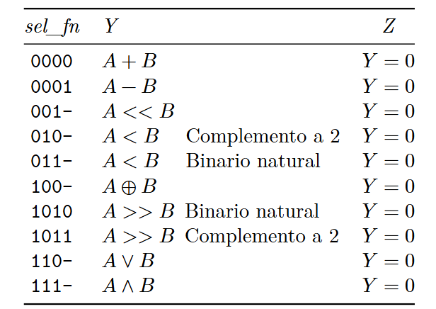

# ACTIVIDAD 7
## UNIDAD ARITMETICA LÓGICA
### SANTILLAN, ATILIO EMANUEL
### INGENIERIA ELECTRONICA
### 2025
---
## RESUMEN

---
## INTRODUCCION
Se desea diseñar una calculadora que cumpla con las siguientes especificaciones.
- Carga de los numeros de 4 bits A y B. 
- Se debe poder seleccionar la funcion a realizar entre A y B.
- Al numero A se le asigna el resultado de la operación.
- La funciones que debe realizar son:
    - Suma
    - Resta
    - Desplazamiento lógico izquierda
    - Menor con signo
    - Menor sin signo
    - Desplazamiento aritmetico derecha 
    - Desplazamiento lógico derecha
    - XOR exclusivo bit a bit 
    - OR exclusivo bit a bit 
    - AND exclusivo bit a bit
- Para las operaciones _suma, resta, desplazamiento lógico izquierda y menor con signo_ el codigo de entrada será __complemento a 2__, mientras que para las demas funciones será __binario natural__.   
- Los dispositivos de entrada a utilizar seran 8 switches de 3 posiciones.
- El dispositivo de salida será un display de 7 segmentos.
- El codigo de salida será __hexadecimal__.
---
## MATERIALES Y METODOS
Para realizar la calculadora, se utiliza una __UNIDAD ARITMETICA LOGICA__. A la misma ingresarán los valores A y B, y simplemente realizara la operacion solicitada. Los codigos de funcion a utilizar seran los siguientes:

---
## RESULTADOS
---
## CONCLUSIONES
---
## REFERENCIAS
---