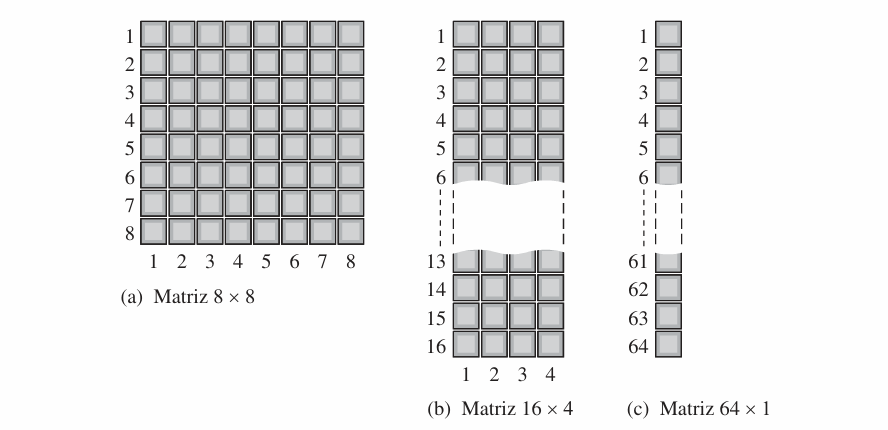
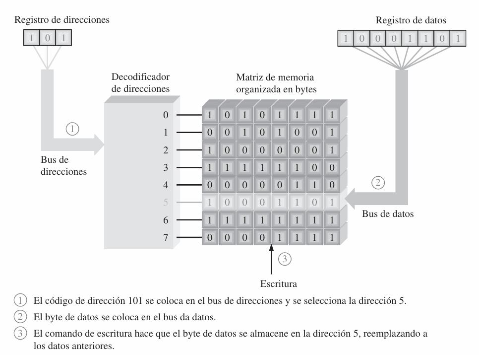
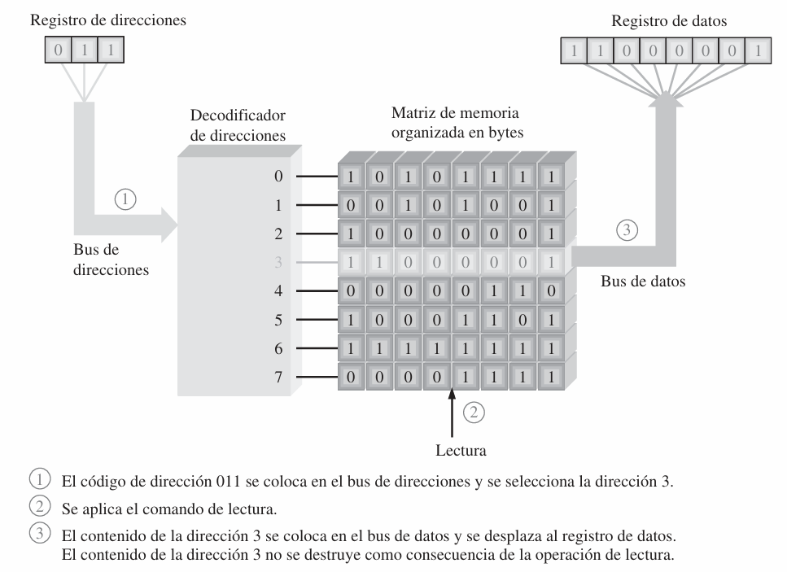

# ACTIVIDAD 8

## MEMORIAS

### SANTILLÁN ATILIO EMANUEL

### INGENIERÍA ELECTRÓNICA

### 2025

---

## RESUMEN

---

## INTRODUCCIÓN

### Memorias

Una memoria es una parte del sistema que almacena grandes cantidades de datos binarios. Se confirman de matrices de celdas de almacenamiento (latches o capacitores (¿flip-flops también?)). En esta matriz, cada celda almacena 1 bit, y se organiza de la siguiente manera:

- Columna: el número de columnas nos indica el ancho de **palabra** (unidad completa de información). En la mayoría de aplicaciones trabajamos con palabras de 8 bits (1 byte), o múltiplos de la misma.
- Fila: Indican la **dirección** (_address_ en inglés) de cada palabra almacenada por la memoria.

A la cantidad de bits que puede almacenar una memoria la llamamos capacidad, y esta puede dividirse en distintos arreglos de filas y columnas. En la **Imagen 1** vemos un ejemplo de esto.

**_Imagen 1_**

Las operaciones básicas que se pueden realizar en una memoria son la **lectura** y **escritura**.

### Operación de escritura:

Consiste en ingresar una cantidad de datos en una posición específica de la memoria. Para ello, se introduce en el **bus de direcciones** un código almacenado en el **registro de direcciones**, este se decodifica, y selecciona la posición de memoria. La memoria recibe entonces una orden de escritura y los datos almacenados en el **registro de datos** se introducen en el **bus de datos**, y se almacenan en la dirección de memoria especificada. En la **Imagen 2** se ilustra este proceso. Si se repite la operación, el nuevo byte de datos se sobre escribe sobre el anterior, y lo destruye.

**_Imagen 2_**

### Operación de lectura:

Consiste en extraer una cantidad de datos de una posición específica de la memoria. Para ello, se introduce en el **bus de direcciones** un código almacenado en el **registro de direcciones**, este se decodifica, y selecciona la posición de memoria. La memoria recibe un orden de lectura y una copia del byte de datos almacenado en la dirección de memoria seleccionada se introduce en el **bus de datos** y se carga en el **registro de datos**.En la **Imagen 3** se ilustra este proceso. Si se repite la operación se conservan el byte almacenado, por lo que la operación de lectura es no destructiva.

**_Imagen 3_**

### Memorias RAM y ROM

Una memoria **RAM**, (_Random Access Memory_), se caracteriza por por demorar el mismo tiempo en acceder a cualquier dirección de memoria, y poder elegirla en cualquier orden, ya sea para lectura o escritura. Una particularidad que tienen, es que pierden la información al desconectar la fuente de alimentación, por lo que se las categoriza como volátiles. Estas se dividen en SRAM (_Static RAM_) y DRAM (_Dynamic RAM_)
Por otro lado, en las memorias **ROM**, (_Read Only Memory_), los datos se almacenan de forma permanente o semi permanente. Estas también son de acceso aleatorio, pero se solo se realizan operaciones de lectura. Además, estas mantienen los datos aun si se desconecta la alimentación por lo que se categorizan como no volátiles.

#### RAM Estática

Las memorias RAM estáticas se caracterizan por utilizar un latch como celda de memoria. Se llaman estáticas, pues cuando se aplica alimentación continua, la celda almacena el bit indefinidamente. En la **Figura 4** , vemos la estructura de la celda de memoria, constituida por una compuerta NAND, cuyas entradas son "Selección" (su estado depende de la dirección seleccionada), y "Entrada de datos" copia el estado del bus de datos en la operación de escritura. Si la operación es lectura, se toma el dato de "Salida de datos".

**_Imagen 4_**

Las SRAM también se dividen en:

- Asíncronas: Las operaciones de lectura/escritura no están sincronizadas con el reloj. Se debe tener consideración con
- Síncronas de ráfaga: Utiliza registros con señal de reloj para sincronizar todas las entradas con el reloj del sistema.

#### RAM Dinámica

---

## MATERIALES Y MÉTODOS

---

## RESULTADOS

---

## CONCLUSIÓN

---

## REFERENCIAS

---
